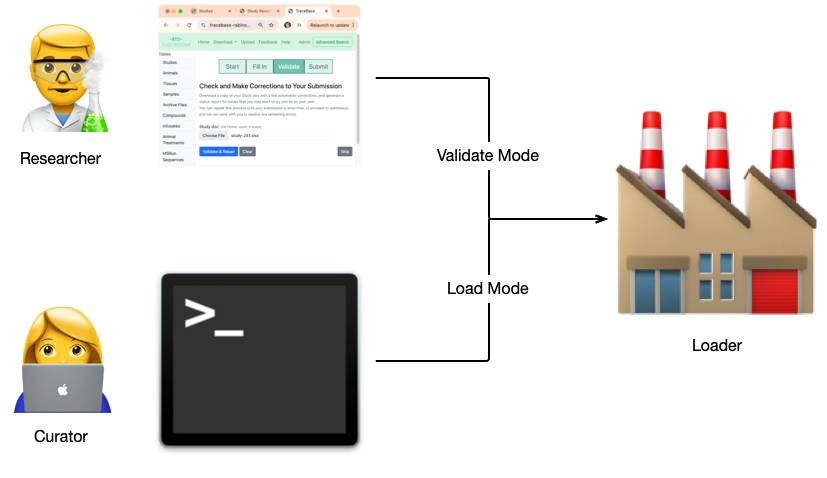

# Under the Hood

Given a development plan with the outlined [goals](TraceBase%20Design.md#Goals), TraceBase contains a number of hidden
features that end users don't usually see, but bring enormous value to the TraceBase codebase in terms of maintenance
and future development efforts.

## Search Strategy

The advanced search was designed to work on any database table field, and works across numerous tables to construct any
desired hybrid representation using a simple configuration file.  The current representations include, for example
[PeakGroups](../Download/About%20the%20Data/Data%20Types/PeakGroups.md),
[PeakData](../Download/About%20the%20Data/Data%20Types/PeakData.md), and
[FCirc](../Download/About%20the%20Data/Data%20Types/FCirc.md).  The search is performed independent of the
configuration, which means that adding or changing fields/columns is a straightforward and trivial task.  Any changes to
the configuration are instantly searchable.  This design choice is powerful in that the Advanced Search interface is
inherently scalable and adaptable.  New search formats can be created with minimal effort.

## Caching Strategy

Caching of various expensive-to-calculate values in TraceBase improves performance.  Typical caching strategies
periodically refresh cached values based on a simple cached value expiration date.  However, this strategy has
drawbacks.  For example, during times of low traffic, the periodic rebuilding of values is susceptible to significantly
impacting the performance of a large search results download, for example.

Additionally, if new data is loaded or changed, cached values can be incorrect until affected cached values are rebuilt,
so a user may occasionally be presented with that inaccurate data.

To solve both of these issues, TraceBase employs a caching strategy that sets monitors on specific data that, if it is
ever changed, will trigger an immediate cache update of the affected values.  That means that as long as a study doesn't
change, performance will always be optimal, and the values always accurate.

## Dynamically Maintained Database Fields

While the caching strategy above assures data accuracy and consistent performance, it has one big drawback: cached
values are not searchable, which is for example, why you cannot search based on calculated FCirc values.  It also has
occasional maintenance tasks associated with it, such as generating those cached values after a load.

An alternate strategy that improves upon the caching (but has not yet been fully integrated) achieves the same accuracy
and performance as caching, but _adds_ search/sort ability, is "maintained database table fields". Designed to be
scalable and adaptable, it works much in the same way that the caching strategy does, as it triggers updates based on
monitored database records, but comes with extra features:

<!-- markdownlint-disable MD007 -->
* Multiple configurable modes that govern when to perform the updates.
* A mass autoupdate feature integrated with the loading scripts (to eliminate all associated overhead tasks).
* An extremely small code usage footprint that can
    * Apply field maintenance to a field in a table with as few as 2 lines of code (when given a method to generate a
      field value), making it highly robust to change.
    * Apply mass autoupdate functionality to load methods with a single line of code.
* Restricts maintained fields from manual updates to ensure accuracy and proper loading code development.
<!-- markdownlint-enable MD007 -->

## Validation Interface

As the most visible under-the-hood feature, the data submission interface's validation page uses the exact same code
that is used to load the database on the backend.  Designing the validation interface this way dramatically reduces
future development efforts and ensures consistency between what users and curators see when working with load data.

One typical pitfall of a large complex data loading (or validation) is that the loading process stops at the first error
it encounters, thus a load attempt is made, an error occurs, the problem is fixed, then you start over and wait through
an entire load attempt again only to encounter another error.  This repeated start/stop is inefficient.  It would be
much more efficient to see all (or as many) of the errors that can be found and then fix them all in one go.  Somtimes,
subsequent errors are unavoidable, but handling them in groups would at least be a step forward.

To reduce the repeated data debugging iterations, the data loading strategy was designed to gather as many errors and
warnings as is possible in a single load/validation attempt.  A number of components and fine-grained strategies
coalesced to contribute to this overall strategy and are described below.

### Consolidated Input

To empower users and expedite the submission building process, eliminating the time consuming back and forth with a
curator when the researcher needs new/novel standardized data, all metadata including nomenclature-controlled data can
be loaded using a single Excel spreadsheet.  A one-stop shop for all data in TraceBase makes the compilation of study
data as smooth as possible.

An Excel spreadsheet was chosen as the vehicle for the data for a few reasons:

<!-- markdownlint-disable MD007 -->
* Formulas could be used to provide drop-downs for data entry to:
    * Ensure nomenclature consistency of both
        * Uniform controlled terminology
        * Consistent flexible terminology (via inter-sheet-populated drop-downs)
    * Reducing the opportunities for user error
    * Speed up manual data entry
* Microsoft Excel is
    * Widely available
    * Familiar to the researchers
<!-- markdownlint-enable MD007 -->

### Standardized Loading

All loading functionality is inherited from a common source that handles the minutiae of loading data so that
individually developed loading scripts can focus on the data.  Every loading script is reversible, using a strategy
called atomic transactions.  This is what allows the loading code to be able to be re-used for the validation page. I.e.
the same loading code that a curator runs to load the database is the same code that researchers run on the validation
page, so that the errors and warnings that the researcher sees while validating their data is exactly what the curator
sees when they attempt to load the submission into the database.  This makes it easy for researchers and curators to
communicate about problems in the submission.

Also, each load data type defines the structure of the associated sheet in the Study Doc (xlsx file), which is
constructed dynamically.  It uses the database table definitions to populate the column headers and datatype and is thus
able to provide tips and information in the spreadsheet itself, while at the same time, making it robust to database
changes.  If a new database table or field is added or changed, updating the loading code is very straightforward and
the Excel sheet update is automatic, making it fast and easy to adapt to change.

### Customized Errors and Warnings and Handling

Database errors on the validation interface can be cryptic and hard to interpret to understand what change is needed to
make in the data to fix it, even for developers, so particular attention was given to creating helpful errors for common
or not-so-common but difficult-to-solve errors.  Anytime an error was encountered, what was learned from the debug
process was saved in a custom error that explains what the issue is and when possible, a suggestion is made as to the
likely fix.

These errors and warnings are aggregated and organized into categorical groups to streamline the submission building
process.  Plus, since repeated similar errors can hamper the process of fixing a submission, similar errors are
collected and summarized in a master error, including the collation and summarization of similar errors from multiple
load scripts.

All of these error features come together to make it possible for researchers to be able to fix data issues on their
own, ensuring that data is loaded as quickly as possible and that researchers, who are the closest to the data, feel
empowered to handle things on their own, and retain a sense of ownership and control over their data, instead of waiting
for a curator to address the issues in a fashion that impeeds the researcher's input.

### Template Creation and Autofill

The most time consuming task in building a TraceBase submission is manual data entry.  To boost the study submission
building process, a custom template can be built by simply submitting all of the peak annotation files, along with
optional mass spec metadata associated with each file.  Samples and compounds will be parsed from those files and as
much metadata as is possible will be automatically entered into a downloaded template.  Standardized data from the
database will be included as well.

Additionally, every time a study doc is validated, any partially entered data will be propagated to other sheets.  For
example, if a novel tissue name is entered in the `Samples` sheet or a compound name is added to the `Tracers` sheet
that does not exist in the corresponding `Tissues` or `Compounds` sheets, that name will be added to the corresponding
sheet in the resulting download.

## Universal Peak Annotation Format

TraceBase currently supports the following peak annotation file types (in Excel, tsv, and csv format):

* [AccuCor](https://doi.org/10.1021/acs.analchem.7b00396)
* [IsoCor](https://doi.org/10.1093/bioinformatics/btz209)
* [Iso-AutoCor](https://github.com/xxing9703/Iso-Autocorr)

However, TraceBase also supports its own internal format called `UniCorr`, which contains only the common portions of
each of the above formats that are relevant to TraceBase.  Each of those formats is automatically converted to the
`UniCorr` format so that the same loading code is used for every peak annotation data source.  Thus, to support a new
data type, all that needs to be developed is a converter to the `UniCorr` format, which is faster to do and easier to
maintain than dealing with a series of largely redundant loaders.

This makes TraceBase more robust to change and scalable, as support for new data types/formats are requested.

## Architecture

TraceBase is built on:

* [Django](https://www.djangoproject.com)
* [PostgreSQL](https://www.postgresql.org/)

As a Django application, you can use any web server to deploy TraceBase that is compatible with:

* WSGI (Web Server Gateway Interface)
* ASGI (Asynchronous Server Gateway Interface) for asynchronous features like WebSockets

TraceBase deployments have only been tested on Linux.

### Database

While Django supports multiple database architectures, we selected PostgreSQL due to its robust features and
reliability.  While not extensively used, there are a few fields and functions used in TraceBase that are specific to
PostgreSQL.  For example, the positions of labels in a tracer compound are kept in a Postgres `ArrayField` and the
format of the display of date-related fields is performed using Postgres-specific functions.

One key PostgreSQL feature we rely on is its unique ability to perform `DISTINCT ON` queries.

For these reasons, an installation of TraceBase using a database architecture other than PostgreSQL is not supported.

### Data Submission via Shared Drive

Some of the data that TraceBase consumes can be rather large, even for a small study.  Most of the bulk of that data
comes from [RAW and mzXML files](../Upload/What%20Inputs%20Does%20TraceBase%20Take.md#raw_data).  The data is too large
to be submitted via a web form, so the transfer of study data is up to the maintainers of any instance of TraceBase.

For the submission of all study data, we recommend setting up a shared drive of your preference that lab researchers own
and can edit and organize however they wish.  The location is described on the Upload **Submit** page, whose content
(e.g. shared drive link) is controlled by environment variables (see `TraceBase/.env.example`).

### Storage and Backup

TraceBase has no built-in backup functionality.  Each instance of TraceBase has its own archive (configured via an
environment variable), but the archive is not a backup.  The database creates and controls the archive.  And all file
download activity on the TraceBase site come directly from that archive.  But note that backing up the archive does not
backup the PostgreSQL database.  In order for the database to function correctly, the archive and database need to be
synchronized.  We recommend backing up both the archive and the PostgreSQL database for a complete backup plan.

Tracking data corrections and changes in the submission process is outside of that recommended backup plan, so it is up
to the curators responsible for loading data to track any changes made to user submitted studies.  For that, we
recommend using a private GitHub repository to house the study doc, peak annotation files, and metadata documentation
(such as a text document describing changes that the curator makes when resolving problems in a submission.)

## Deployment and Data Privacy

TraceBase was designed to be lab-specific.  It has no user-accounts and no data ownership control, so it is up to
systems administrators to employ authentication processes to govern access.  Anyone with access to TraceBase has access
to all of its data.  If you would like a subset of data to be public, you must setup and load publicly accessible
studies on a separate public instance of TraceBase, with its own database and web server.

For help on deploying TraceBase, reach out to the development [[Team]].

## Maintenance

All loading and database maintenance of TraceBase happens on the command-line utilizing django management commands.
Those who install TraceBase are responsible for its maintenance and the curation process (with the assistance of a
responsible party in the lab, familiar with the scientific data).

For information on managing TraceBase, reach out to the development [[Team]].
