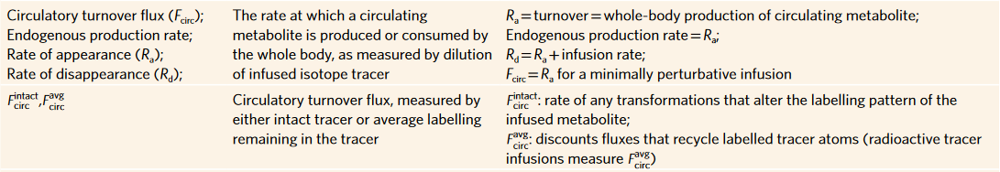
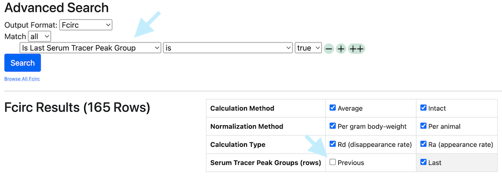

# FCirc

FCirc data has a row for every combination of serum sample, tracer, and labeled element.

Downloaded FCirc data has a [standard format](../Format%20of%20Downloaded%20Data.md).

See [For Multiple Tracers or Labeled Elements](#MultipleTracersElements).

## Definition

Circulatory Flux (FCirc) is defined as the steady-state flux of metabolite between tissues and bloodstream(see
[Bartman, TeSlaa, and Rabinowitz](https://doi.org/10.1038/s42255-021-00419-2)).

Typically, FCirc is measured by infusing a labeled tracer to a steady state and measuring its dilution in the animal.
The labeling of the tracer compound in serum and the known rate of tracer infusion are used to calculate FCirc.  There
are key assumptions of steady state and minimal perturbation in typical calculations of FCirc - see the above reference
for details.

## Types of FCirc

A researcher may wish to calculate multiple forms of FCirc depending on their experimental goals.  These forms are based
on whether the tracer infusion is included in the flux (Ra vs Rd, or "rates of appearance versus disappearance" of the
fully labeled tracer) and whether the intact or atom-averaged flux is preferred.  TraceBase calculates all of four of
these and automates the standard calculations for FCirc without making any assumptions.

(from Bartman, TeSlaa, and Rabinowitz)

It's important to note however that serum samples are collected at multiple points before sacrifice and TraceBase
calculates FCirc values for **every** serum/plasma sample, regardless of steady-state.  So be aware that for that
reason, TraceBase makes a distinction between FCirc values calculated from the **last** serum sample and all prior Serum
Samples, but note that the best value **may** sometimes be the average of the last few, thus TraceBase presents FCirc
calculations for every individual Serum Sample, regardless of timepoint.

The FCirc view in the Advanced Search can be filtered for the "last serum sample" manually, as a row in the search or
using the checkbox shortcut above the results:

It's also important to note that TraceBase will report an Ra value in an infusion that was perturbative.  This can still
be a useful and valid measurement, but it should not be interpreted as the normal circulatory flux (FCirc).

Finally, FCirc can either be normalized to animal body weight (reported as nmol/minute/gram body weight) or not
(nmol/minute/animal).  TraceBase calculates all of these so that the researcher can select the appropriate measurement.

## For Multiple Tracers or Labeled Elements

An animal can be infused with multiple tracers and any tracer can have multiple different labeled elements.

FCirc values are calculated separately for each labeled element in each tracer compound.  This was a specific design
choice made to enable comparison of tracer infusions across different studies.  For example, FCirc-intact for carbon can
be directly compared between an animal given U13C-alanine infusion and another animal given U13C-15N-alanine infusion.

* Note that for "intact" FCirc values, this is different than "any transformation".  (e.g. the FCirc-intact for
  U13C-15N-alanine infusion counts U13C-alanine and U13C-15N-alanine as un-transformed).

## Calculations

See [FCirc Rates](../../../Values/FCirc%20Rates.md)
