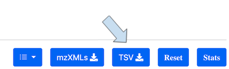
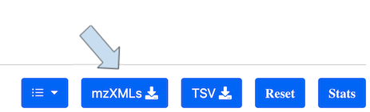

# How to Download

TraceBase data can be downloaded in three ways, using:

* The Download button in the top menu bar
* The TSV and mzXML buttons in the Advanced Search results
* The export menu above summary tables accessible via the left side bar

All the table data in TraceBase can be downloaded by clicking the "Download" button in the top menu bar.  This has
strictly defined [Format of Downloaded Data](About%20the%20Data/Format%20of%20Downloaded%20Data.md), which can be used
for analysis outside of TraceBase.

Data found in the Advanced Search page can also be downloaded in the same format by clicking the blue download button.

Additionally, download of the source data (i.e. the `mzXML` files) can only be obtained from the Advanced Search page by
clicking the blue mzXMLs download button.

The mzXMLs download button on the advanced search downloads a ZIP archive containing a TSV file listing the mzXML files
with associated metadata and mzXML files organized into subsirectories.  See the
[ZIP](About%20the%20Data/Format%20of%20Downloaded%20Data.md#ZIP) format description for details.

TraceBase metadata found in other pages (e.g. "Studies" table) can be downloaded in multiple formats by clicking the
blue download button.  These are typically sample information tables that do not contain the underlying PeakGroups,
PeakData, or Fcirc data.  For example, the Compounds table can be downloaded as a CSV, TXT, or XLS file.

