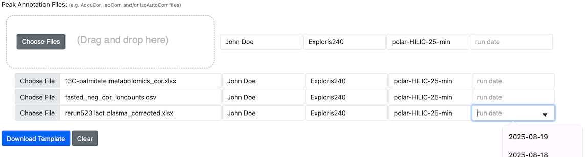

# How to Start an Upload

## How to Leverage Peak Annotation Files to Jump Start a Data Submission

TraceBase accepts mass spectrometry data that has been corrected for the natural abundance of isotopomers.

Specifically, TraceBase supports the output from 3 popular tools for natural abundance correction:

* [AccuCor](https://doi.org/10.1021/acs.analchem.7b00396) _([AccuCor on GitHub](https://github.com/lparsons/accucor))_
* [IsoCor](https://doi.org/10.1093/bioinformatics/btz209) _([isocorr13C15N on GitHub](https://github.com/xxing9703/isocorr13C15N))_
* [Iso-AutoCor](https://github.com/xxing9703/Iso-Autocorr)

Therefore, a typical workflow to put data on TraceBase could be:

<!-- markdownlint-disable MD007 -->
1. Select peaks from a set of `.mzXML` files using either of these peak-picking tools
    * [Maven](http://maven.princeton.edu/index.php)
    * [El-Maven](https://www.elucidata.io/el-maven)
2. Correct for natural abundance using AccuCor or IsoCor
3. Upload data to TraceBase to generate a submission template
<!-- markdownlint-enable MD007 -->

TraceBase uses an Excel spreadsheet called a `Study Doc` to label and organize submission data.

The Upload **Start** page does not save your uploaded peak annotation files in TraceBase.  Its only purpose is to create
a Study Doc from scratch using your peak annotation files, so feel free to submit any combination of the files mentioned
above as either a:

<!-- markdownlint-disable MD007 -->
* Microsoft Excel Spreadsheet
* Corrected data sheet only in one of 2 plain text formats (e.g. using NotePad or TextEdit):
    * CSV (comma separated values)
    * TSV (tab separated values)
<!-- markdownlint-enable MD007 -->

<!-- textlint-disable terminology -->
The default file name of a study doc generated by the Upload **Start** page is `study.xlsx`.  It is suggested that you
rename this file using the study name (without spaces), but any name is acceptable.
<!-- textlint-enable terminology -->

Ensure that each peak annotation file is annotated with the Mass Spec Run information using the fields next to each
file.

## How to Label Mass Spec Run Information

The Start page interface provides form elements to enter metadata about the MS Run associated with each peak annotation
file.  Each field has a drop-down, but any value can be entered.

* MS Operator
* Instrument
* LC Protocol
* Run Date

Since it is expected that multiple peak annotation files will have much of the same metadata, you can enter terms common
to all the files you intend to drop.  After dropping the files, you can enter the specific values relevant to each
specific file.

The fields next to the drop area will apply to every file dropped, but they must be filled in **before you drop them**,
as the form fields next to the drop area are ignored when the form is submitted.  Only the values next to each
individually dropped file are submitted in the final form.  You can edit those associated with each individual file
using the form rows that appear below the drop area for each dropped file.  For example:

>> 
>>
>> In this example, the operator, instrument, and LC protocol were filled in before dropping and the date was left empty
>> because each was run on a different date, to be filled in after dropping in the forms that appear below the drag and
>> drop area.

The metadata entered about each Mass Spectrometry Run is distilled into unique rows and saved in the `Sequences` sheet
in the Study Doc.  There is no succinct ID/Name for each of these rows, so an Excel formula is used to generate one that
is available in drop-downs in 2 other sheets:

* The `Peak Annotation Files` sheet, which denotes a "default" associated run associated with a peak annotation file
* The `Peak Annotation Details` sheet, whose values can override the default set in the `Peak Annotation Files` sheet.

All of these values will be automatically populated when you supply the metadata on the **Upload** page's **Start** tab.

Read on for details about each tracked piece of MS Run metadata.

### Run Date

Date that the sequence was run on the mass spec instrument in `YYYY-MM-DD` format.  The drop-down on the Upload
**Start** page provides selections for the past 2 weeks, but any date can be entered.

### Instrument

The instrument (model) that was used for the MS Run.

Note that there is no distinction made between 2 instruments of the same model.

Current options:

* HILIC
* QE
* QE2
* QEPlus
* QEHF
* Exploris240
* Exploris480
* unknown

A new instrument model can be entered and the select list will automatically include the new model in the future after
the study is loaded.

### Operator

The name of the researcher who prepared samples for MS and ran them on the instrument.  A drop-down is provided on the
Upload **Start** page to mitigate name variants.

### LC Protocol

Name of the Liquid Chromatography LS Protocol used.

* polar-HILIC-25-min
* polar-reversed-phase-ion-pairing-25-min
* polar-reversed-phase-25-min
* lipid-reversed-phase-25-min
* SCFA-reversed-phase-22-min
* unknown

Any novel LS Protocol can be entered and will appear in the `LC Protocols` sheet in the Study Doc, but names should have
no spaces (only dashes), start with the LC Method, end with `-min`, have a run length greater than `0`, and appear in
the following format:

`MYNAME-0-min`

>> Example: `lipid-reversed-phase-25-min`
>>
>> This method involves the analysis of lipids using reversed-phase chromatography on C18 columns, coupled with high
>> resolution mass spectrometry.  It is mainly used for the analysis of lipids.

If you need to edit the protocol in the Study Doc, do not edit the `Name` column.  Edit the other columns in the sheet
and copy the formula from the first unpopulated row in the `Name` column to paste on the edited row.

### Polarity and Scan Range

Note that polarity and scan range are not recorded in the Study Doc.  This information is only ever automatically
extracted from the `mzXML` files, if supplied with your final submission.

### Notes

The Study Doc's `Sequences` sheet has a `Notes` column if you want to add any extra information about the run that is
not captured in the other columns.  You can add that information after generating the Study Doc template.

## How to Handle Errors and Warnings encountered on the Start Page

The Upload **Start** page is the only tool in the submission process that checks for conflicts between your peak
annotation files.  If any errors or warnings are encountered on that page, they must be fixed in the downloaded Study
Doc.  The **Validate** page will not bring them up again (unless they refer specifically to the otherwise hidden `Peak
Group Conflicts` sheet).

If an error or warning encountered on the **Start** page is not enough to know what to do to fix it, it may help to look
up a more detailed explanation of what the exception means, what can cause it, or how to fix it.  Every current custom
TraceBase exception is provided in the [Errors and Warnings Reference](../Errors%20and%20Warnings%20Reference.md).  You
can use it to search for the exception name to see what extra guidance it provides.
