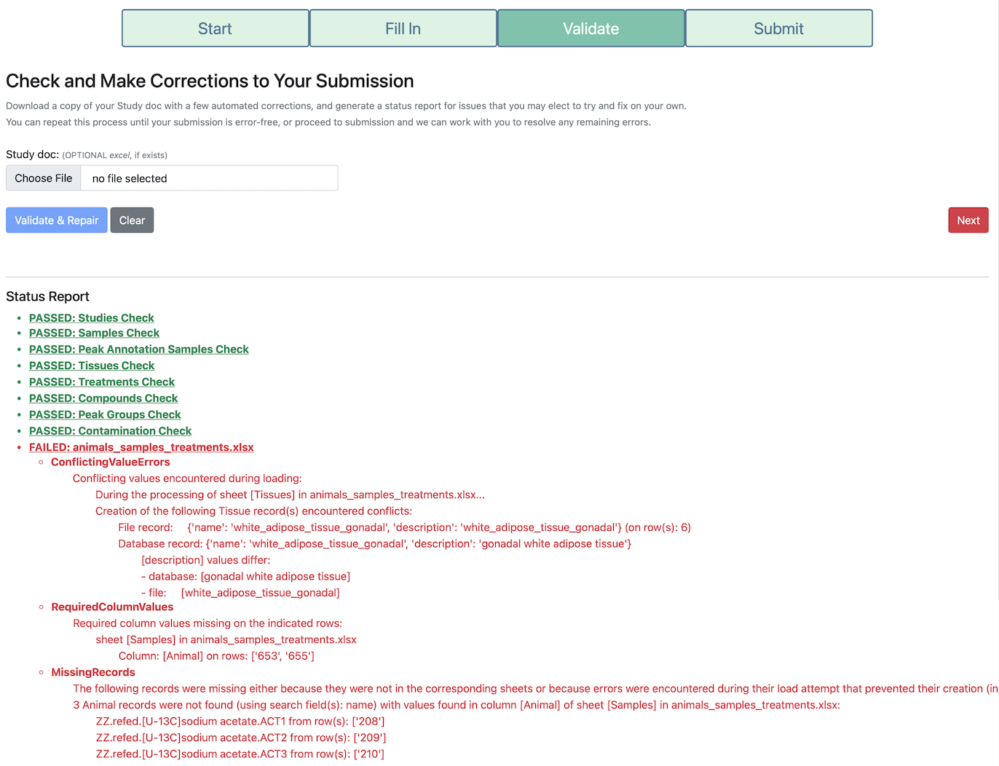

# How to Validate a Study Doc

TraceBase empowers researchers by giving them the tools control all of the data associated with their work.  You are the
owner of the data, after all.  But it also gives you the flexibility to engage with the data issues at a level that is
entirely your own discretion.  Given the complex relationships of the data inherent in the Tracebase database, there are
any number of cryptic database errors that can arise, so we went to the effort to encapsulate common problems in custom
error messages that are understandable and actionable to an end user.  To that end, if you encounter any errors or
warnings that are difficult to understand, we would value your
[feedback](https://docs.google.com/forms/d/e/1FAIpQLSdnYe_gvKdoELXexZ9508xO8o59F1WgXcWBNh-_oxYh9WfHPg/viewform?usp=pp_url&entry.1881422913=/TraceBaseDocs/TraceBaseDocs)
on what errors are difficult to understand or your suggestions on how they could be improved.

Here's an example of a few of the errors you might expect to see:

## General Tips and Strategies for Fixing Errors

After you run the validation and receive a status report detailing issues found in the Study Doc, you can fix those
issues in the Study Doc itself and resubmit to see if the error or warning goes away.  Here are some suggestion that
will make this process go quickly and smoothly.

* **Make most of your edits to your uploaded file instead of the "repaired" version that is downloaded**

    The validation page always exports a copy of your study doc, potentially with some minor repairs, but in most cases,
    you should conduct your manual repairs on the originally uploaded Study Doc and throw out the downloaded version,
    mainly because the exported study doc that gets downloaded does not preserve excel formulas, such as those that
    generate the intersheet drop-down menus.  Thus, changing any of those values to address an error in the downloaded
    copy becomes more laborious because the dropdowns are gone.

    If anything is actually repaired, a warning will inform you that data was either added or removed.  Focus your
    efforts on manually repairing other issues first in your original uploaded Study Doc and leave the automatically
    repaired issues for last.  In most cases, these automatically repaired issues are to add rows for broken inter-sheet
    references or remove rows, like blanks in the Samples sheet that are not loaded.  For example, if you enter a novel
    tissue in the tissue column of the Samples sheet that is not listed in the Tissues sheet, a row with that tissue
    name will be added to the tissues sheet.  If you have a repair warning that says data was added after all other
    issues are addressed, switch to the downloaded file.

* **Ignore cryptic errors, if you encounter them**

    Most errors you are likely to encounter are ones that have been customized and summarized with descriptions intended
    to be understood and actionable by a user.  Often, the end of the error will contain a suggested fix.  If an error
    seems cryptic or technical, it is likely one that we haven't encountered before.  Feel free to leave such errors for
    a curator to resolve.

* **Validate frequently and often**

    Validating is an iterative process.  After fixing any number of reported issues, you can submit to validate again to
    see if your fixes worked.  The validation page tries to find as many issues as it can, however sometimes the
    existence of one issue will occlude another, so don't be surprised if after fixing one issue, a new issue appears
    upon subsequent validation.

* **Fix the first of repeated or similar errors and then revalidate**

    The validation page tries to limit cascades of errors that all stem from a root cause, but it's not perfect, so if
    you see repeated errors or errors that make no sense, fix the first one or as many as you can and then revalidate to
    see if the root cause has been addressed and the repeated errors disappear.

# TODO: Add documentation on the specific errors
