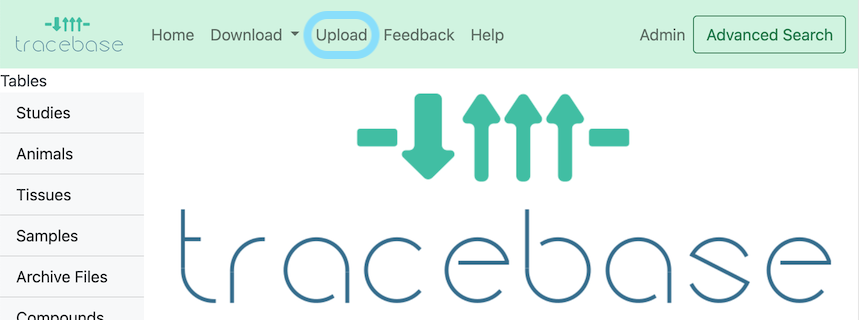
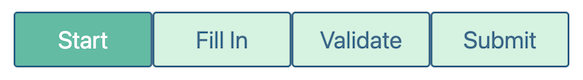

# How to Upload Data to TraceBase

_This is a general introduction to the data submission process.  For frequently asked specific questions, see the_
_[[Uploading FAQ]]._

At a high level, you will construct a Study Doc (Excel workbook) which provides the information required for upload.
Then, you provide a copy of the Study Doc, peak annotation files, and optionally, mzXML and raw files in the lab's
designated [shared drive](../About/Under%20the%20Hood.md#shared_drive).  Finally, a TraceBase curator reviews your
submission, works with you to resolve any issues, and then loads the data to TraceBase.

The submission process includes helpful instructions both on the Upload pages and in the study doc template itself, so
users are encouraged to begin a submission and then consult this documentation if anything is unclear.

To get started, click the upload button in the menu bar at the top of the page.

>> _Note: uploading can be disabled, in which case there would be no upload option in the menu bar._

There are 4 tabs on the Upload Page that proceed from left to right:

Upon finishing any one page, you can leave and come back.  Your work is saved in the downloaded Study Doc.

## Step-by-Step Instructions

### 1. Start - Create a Study Doc

Drop your peak annotation file(s) into the dotted outline, or select them using the button. Complete the form fields for
each file. A unique biological sample will be created from the sample headers spread across your various peak annotation
files.

Click "Download Template".  TraceBase reads the names of samples and compounds in your files, and then provides a
template with this information pre-filled.

For details on how best to leverage this feature, see
[How to Start an Upload](How%20to%20Build%20a%20Submission/1%20-%20How%20to%20Start%20an%20Upload.md).

### 2. Fill In - Enter data into the Study Doc using Excel

The "Fill In" tab contains specific pointers and tips on how to fill in data in the Study Doc (Excel spreadsheet).  You
can also find useful information in the header row comments, which will contain tips like the expected units, value
format (e.g. date format), and a description of the values.

If anything is unclear, know that the next step (Validation) will help identify and correct issues, and your data will
not be loaded to TraceBase until the curators have reviewed it.

For some general tips to keep in mind that can ensure the process proceeds smoothly and for detailed information, see
[How To Fill In the Study Doc](How%20to%20Build%20a%20Submission/2%20-%20How%20To%20Fill%20In%20the%20Study%20Doc.md).

### 3. Validate - Check your Study doc for warnings and errors

At any point (whether your study doc is completely filled in or not), you can check it for errors by validating it on
the Upload **validate** page.

**It is not required for you to fix any reported issues, but pay particular attention to any warnings (displayed in**
**yellow) because warnings are treated by curators as unnecessary fixes or are issues that are at the discretion of**
**the researcher to resolve.**

A curator will fix issues for you, but note that any efforts you make to fix errors will speed up the loading of your
data, especially if the fixing of any error requires your domain knowledge.

After submission, a curator will keep a log of any changes they make for you to review and approve before the load.

The validation process is iterative.  You can re-validate anytime you fix a single, multiple, or all issues.  Every time
you fix all issues, you should validate one last time, even if the fix is a simple one, to ensure those fixes didn't
reveal previously hidden errors (i.e. errors that will not occur until another dependant error is addressed).

As with the previous steps, the validation process is designed to be self explanatory, so feel free to jump right in and
start validating.  If you'd like to know more, see
[How to Validate a Study Doc](How%20to%20Build%20a%20Submission/3%20-%20How%20to%20Validate%20a%20Study%20Doc.md).

### 4. Submit - Organize your files and notify the curators

In short, compile all of your data in a shared drive and submit the short linked Google form.

Under the "Submit" tab, follow the directions on how to organize and where to deposit your data.  Then click the
"Submission Form" button and fill out the short Google form to let the curators know that your submission is done.

For details on organizing and submitting data, see
[How to Submit Data](How%20to%20Build%20a%20Submission/4%20-%20How%20to%20Submit%20Data.md).

## What happens next?

TraceBase curators will re-validate your study to ensure that everything will load smoothly.  If there are any issues,
you will be contacted to sort everything out.  The study data will be loaded into TraceBase and you will be notified of
the load completion via email so you can start browsing your data.

[Contact us](https://forms.gle/LNk4kk6RJKZWM6za9) anytime if you would like to check in on the load status or if you
have any questions, concerns, comments, or discover any post-load issues.
