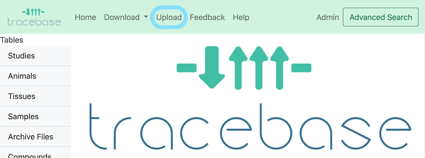
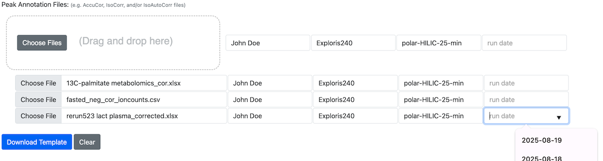

# Uploading Data to TraceBase

This is a general introduction to the data submission process.  For frequently asked specific questions, see the
[[Uploading FAQ]].

## How "ready" does my data have to be to upload to TraceBase?

Every data submission to TraceBase (sample metadata, peak annotation files (AccuCor/IsoCor/Iso-AutoCor), and RAW/mzXML
files) is described/organized in a submission template we refer to as a **Study Doc** (an Excel Spreadsheet).  You can
create a study doc that contains the samples/animals associated with as few as one peak annotation file, an entire MS
Run, a whole Study, or even multiple studies.  We recommend that as soon as you have a peak annotation file, you draft a
submission to TraceBase.

The submission process uses the peak annotation files to automate the entry of a large portion of the metadata when you
download the template, such as sample names and compounds, but some manual metadata entry (for example, describing the
animals and samples) is required.  The required columns are highlighted in blue in the downloaded Study Doc^.  See the
[[#instructions]] below for details.

> ^ _Note that in order for FCirc calculations to be displayed on TraceBase, some optional columns described at the top_
> _of the [FCirc Rates](../Values/FCirc%20Rates.md) are required._

The upload process ensures that the data integrity is preserved from study to study and from sample to sample.  For
example, the process ensures:

* Samples are labeled accurately.
* Animal, Sample, and Study names are unique.
* Consistent nomenclature is used.

Your data is initially uploaded to a private folder, where a curator checks the data to ensure it is formatted correctly
before it is loaded.  When all checks have passed, the curator adds the data to TraceBase.  This means it is OK (and
expected) for your data to be imperfectly labeled when you initially submit for upload, however the process provided
empowers each user to be able to solve problems on their own.  As the author of the data, you are the most knowledgeable
person to fix issues that come up.  However, you can choose to engage as much as you want in the validation of your
data.

## Step-by-step Instructions

The submission process is designed to be as self-explanatory as possible.

To get started, click the upload button in the menu bar at the top of the page.

>> _Note: uploading can be disabled, in which case there would be no upload option in the menu bar:_
>> 

There are 4 tabs on the Upload Page that proceed from left to right:

Upon finishing any one page, you can leave and come back.  Your work is saved in the downloaded Study Doc.

### 1. Start - Create a Study Doc

The start page is designed to create a submission template (a.k.a. a "Study doc") from scratch using your peak
annotation files.  The simplest usage is to drop all of your peak annotation files (e.g. "AccuCor") in one drag
operation onto the drag and drop area and click "Download Template".  The tool will automatically extract your samples
and compounds and use them to pre-fill the template sheets.

You can submit any combination of

* [AccuCor](https://doi.org/10.1021/acs.analchem.7b00396)
* [IsoCor](https://doi.org/10.1093/bioinformatics/btz209)
* [Iso-AutoCor](https://github.com/xxing9703/Iso-Autocorr)

files either as their excel file or a CSV or TSV version of just their corrected values sheet.

You can save yourself some time in the next step by filling in the requested metadata associated with each peak
annotation file:

* MS Operator (the name of researcher who ran the Mass Spec)
* Instrument (e.g. Exploris480)
* LC Protocol (e.g. polar-HILIC-25-min)
* Run Date (in YYYY-MM-DD format)

Each field has a drop-down, but any value can be entered.

The fields next to the drop area will apply to every file dropped **before you drop them** (to avoid repeated manual
entry).  The form fields next to the drop area are ignored when the form is submitted.  Only the values next to each
individually dropped file are used.  You can edit those associated with each individual file after dropping in the rows
that appear below for each dropped file:

>> 
>>
>> In this example, the operator, instrument, and LC protocol were filled in before dropping and the date was left empty
>> because each was run on a different date, to be filled in after dropping in the forms that appear below the drag and
>> drop area.

### 2. Fill In - Enter data into the Study Doc using Excel

The "Fill In" tab contains specific pointers and tips on how to fill in data in the Study Doc (excel spreadsheet).  You
can also find useful information in the header row comments, which will contain tips like the expected units, value
format (e.g. date format), and a description of the values.

Generally, the process should be fairly self explanatory, and the validation page will ensure information is entered
completely and correctly, but there are some general tips to keep in mind that can ensure the process proceeds smoothly.

* **Fill in the sheets from left to right.**

    Each sheet can reference any other sheet(s), usually by the other sheet's first column (e.g. the Samples sheet's
    Animal column references the Name column of the Animals sheet).  And those referencing columns (e.g. the Animal
    column in the Samples sheet), unless they were automatically filled from the Start tab, will have drop-downs that
    are populated by the contents of the referenced sheet.  Generally, the order of the sheets in the Study Doc is
    arranged from left to right so that when you encounter those referencing columns, their drop-downs will be
    populated.

    The inter-sheet referencing allows each sheet to stand alone.  In fact, a study doc can contain any subset of the
    contained sheets and still be loaded by itself, as long as the data it references in any other sheet has been
    previously loaded.

* **If you forgot a peak annotation file or mistyped a date or other MSRun Metadata on the **Start** page, start over.**

    If during the process of filling in the Study Doc, you discover that you omitted a peak annotation file (e.g.
    _AccuCor_ file) or made a mistake in your original submission, it is recommended that you start over^ and upload all
    peak annotations on the **Start** page with the correct information again.  Carefully copy over data from the
    previous version, if you had already spent time filling it out.

    This is recommended for 2 reasons.  The main one is that the **Start** page performs cross-peak annotation checks
    that the validation page does not do, the main one being checks for multiple representations of compounds in a
    sample.  The other reason is because of the auto-filled inter-sheet references.  Adding new samples and/or compounds
    will likely end up causing incomplete sheets that are laborious to fix manually.

    ^ _There is a feature planned that will allow the **Start** page to **update** an existing Study Doc, but until_
    _that is implemented, starting over is much less error-prone._

* **Fill in all of the blue columns, don't fill in the gray columns, and make sure that every column referenced in the**
    **[FCirc Rates](../Values/FCirc%20Rates.md) is filled in to ensure that the FCirc calculations will be able to be**
    **completed.**

    The blue columns are required for loading and the gray columns are controlled by excel formulas.  Formulas usually
    only extend a few rows past the auto-filled rows, so if you need more, use excel's fill-down feature.  The
    validation process on the next page does not preserve formulas, so it can be helpful to keep the original **Start**
    page download to retrieve formulas.

* **Don't fill in the mzXML column in the Peak Annotation Details sheet**

    mzXML filenames can be automatically matched to the sample headers in the peak annotation (e.g. _AccuCor_ files).
    The loading code is even smart enough to handle filenames that were modified to add "pos", "neg", "scan1", "scan2",
    etc - which are referred to as "scan labels".  This column is not automatically populated^ due to the frequent
    presence of empty mzXML files and the impracticality of uploading those files for mapping, but the loading code
    works this all out on the fly.  The only time you have to fill values in, in this column, is when the filenames
    differ from the sample headers outside of the scan labels.

    ^ _There is a feature planned that will allow a user to drop an entire Study **directory** on the **Start** page to_
    _map **just** the mzXML file **names** to the peak annotation file sample headers based on common parent
    _directories, and auto-fill the mzXML column in the Peak Annotation Details sheet._

### 3. Validate - Check your Study doc for warnings and errors

Submit your filled-in study doc for validation.

Pay particular attention to any warnings (displayed in yellow) because warnings are treated by curators as unnecessary
fixes or are issues that are at the discretion of the researcher to resolve.

**It is not required for you to fix any reported issues.**  A curator will fix issues for you, but note that any efforts
you make to fix errors will speed up the loading of your data, especially if the fixing of any error requires your
feedback.

Here's an example of the errors you might expect to see:

After submission, a curator will keep a log of any changes they make for you to review and approve before the load.

As with the previous steps, the validation process is designed to be self explanatory, so feel free to jump right in and
start validating.  If you'd like to know more, read on for some general tips...

* **Make most of your edits to your uploaded file instead of the "repaired" version that is downloaded**

    The validation page always exports a copy of your study doc, potentially with some minor repairs, but in most cases,
    you should conduct your manual repairs on the originally uploaded Study Doc and throw out the downloaded version,
    mainly because the exported study doc that gets downloaded does not preserve excel formulas, such as those that
    generate the intersheet drop-down menus.  Thus, changing any of those values to address an error in the downloaded
    copy becomes more laborious because the dropdowns are gone.

    If anything is actually repaired, a warning will inform you that data was either added or removed.  Focus your
    efforts on manually repairing other issues first in your original uploaded Study Doc and leave the automatically
    repaired issues for last.  In most cases, these automatically repaired issues are to add rows for broken inter-sheet
    references or remove rows, like blanks in the Samples sheet that are not loaded.  For example, if you enter a novel
    tissue in the tissue column of the Samples sheet that is not listed in the Tissues sheet, a row with that tissue
    name will be added to the tissues sheet.  If you have a repair warning that says data was added after all other
    issues are addressed, switch to the downloaded file.

* **Ignore cryptic errors, if you encounter them**

    Most errors you are likely to encounter are ones that have been customized and summarized with descriptions intended
    to be understood and actionable by a user.  Often, the end of the error will contain a suggested fix.  If an error
    seems cryptic or technical, it is likely one that we haven't encountered before.  Feel free to leave such errors for
    a curator to resolve.

* **Validate frequently and often**

    Validating is an iterative process.  After fixing any number of reported issues, you can submit to validate again to
    see if your fixes worked.  The validation page tries to find as many issues as it can, however sometimes the
    existence of one issue will occlude another, so don't be surprised if after fixing one issue, a new issue appears
    upon subsequent validation.

* **Fix the first of repeated or similar errors and then revalidate**

    The validation page tries to limit cascades of errors that all stem from a root cause, but it's not perfect, so if
    you see repeated errors or errors that make no sense, fix the first one or as many as you can and then revalidate to
    see if the root cause has been addressed and the repeated errors disappear.

### 4. Submit - Organize your files and notify the curators

In short, compile all of your data in a shared drive and submit the short linked Google form.

Under the "Submit" tab, follow the directions on how to organize and where to deposit your data.  Then click the
"Submission Form" button and fill out the short Google form to let the curators know that your submission is done.

Note that **you can arrange the study directory however you want**, but where possible, it is best to colocate peak
annotation (e.g. _AccoCor_) files with the mzXML files that were used to generate them, ideally with one peak annotation
file per directory.  This will make resolving which same-named mzXMLs go with which peak annotation files, possible.
Typically, peak annotation files are associated only with the mzXML files in the immediate directory (not those in
subdirectories), but if a peak annotation file was generated with a mix of mzXMLs, some of which were used to generate
other peak annotation files (but not all), place the peak annotation files in a common parent directory, under which
multiple subdirectories contain all of its mzXML files, even though it may include unassociated mzXML files.

### What happens next?

TraceBase curators will re-validate your study to ensure that everything will load smoothly.  If there are any issues,
you will be contacted to sort everything out.  The study data will be loaded into TraceBase and you will be notified of
the load completion via email so you can start browsing your data.

[Contact us](https://forms.gle/LNk4kk6RJKZWM6za9) anytime if you would like to check in on the load status or if you
have any questions, concerns, comments, or discover any post-load issues.
